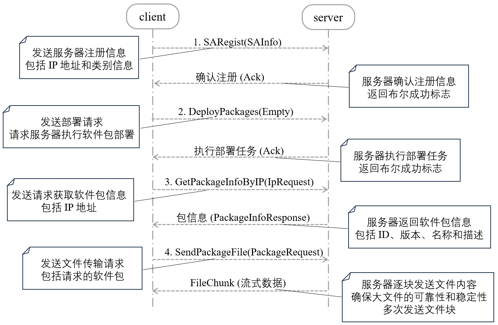

## 业务服务器与主机通信设计

在业务服务器上，首先创建了一个 HTTP 客户端，它使用 `hyper` 库提供的功能来处理 HTTP 请求。为了与 gRPC-Web 兼容，客户端配置了一个中间件层 (`GrpcWebClientLayer`)，这使得 HTTP 客户端能够处理 gRPC-Web 的请求和响应。业务服务器通过指定的地址（如 `http://192.168.31.145:3000`）创建了一个 `SAControlClient` 实例，并将其封装在一个 `Arc<Mutex>` 中。这种封装方式使得客户端能够安全地在多线程环境中使用。

主机部分使用 `tonic` 库创建了一个 gRPC 服务，并且通过 `tonic_web` 启用了 gRPC-Web 支持。主机的地址和端口被设置为 `192.168.31.145:3000`。主机通过 `Server::builder` 配置了 HTTP/1.x 支持，以便与 gRPC-Web 兼容。主机初始化并启动了 `SAControlServer`，并开始监听指定的地址。

本项目使用 Protocol Buffers（简称 Proto）来定义 gRPC 的通信协议，版本使用 `proto3` 语法。

下图是服务的通信协议图示，展示了主机与业务服务器之间的交互流程以及消息定义。



### 1. 服务和消息定义

- **服务定义**：

  SAControl服务包括以下 RPC 方法：

  - `DeployPackages(Empty) returns (Ack)`：用于在服务器端执行部署软件包的操作。客户端调用该方法后，服务器端将根据预定义的规则进行软件包的自动部署。
  - `SARegist(SAInfo) returns (Ack)`：用于在服务器端注册服务器信息。客户端发送服务器的 IP 地址和类别信息，服务器端接收后确认注册。
  - `GetPackageInfoByIP(IpRequest) returns (PackageInfoResponse)`：根据 IP 地址请求获取软件包信息。客户端发送 IP 地址请求，服务器端返回该 IP 地址对应的包信息（如 ID、版本、软件名称和描述）。
  - `SendPackageFile(PackageRequest) returns (stream FileChunk)`：客户端请求软件包文件传输，服务器端通过流式数据传输的方式发送文件块。
- **消息定义**：

  - `Empty`：一个空消息，用于无参数请求。
  - `IpRequest`：包含 IP 地址的请求消息。
  - `SAInfo`：包含服务器 IP 地址和类别的注册信息。
  - `Ack`：一个确认消息，包含布尔类型的成功标志。
  - `ProgramDirectory`：包含程序目录信息，使用名称和子目录列表。
  - `TasksList`：任务列表，包含任务名称的重复字符串。
  - `TaskRequest`：任务请求，包含任务名称列表。
  - `Data`：包含字符串数据的消息。
  - `VersionInfo`：包含版本信息的消息。
  - `PackageRequest`：包含类别信息的请求消息。
  - `FileChunk`：用于文件传输的消息，包含文件内容（字节）和文件类型（字符串）。
  - `PackageInfoResponse`：包含包的 ID、版本、软件名称和描述的响应消息。

### 2. 主机与业务服务器的交互流程

1. **注册阶段**：业务服务器通过 `SARegist` RPC 方法向主机注册自身信息，包括服务器 IP 和类别信息。主机在接收到此请求后，确认并记录该信息。
2. **部署请求阶段**：业务服务器调用 `DeployPackages` 方法，向主机发送部署请求。主机根据请求指示，执行相应的自动化部署任务。
3. **获取软件包信息**：业务服务器通过 `GetPackageInfoByIP` 方法，按需向主机请求特定 IP 地址的相关软件包信息，主机将返回相应的版本、软件名称等详细信息。
4. **文件传输**：当需要更新或安装新的软件包时，业务服务器使用 `SendPackageFile` 方法请求文件传输。主机通过流的形式逐块发送文件内容（`FileChunk`），确保大文件的传输可靠性和稳定性。

### 3. 业务服务器设计

1. **异步获取本地 IP 地址**

   业务服务器需要获取本机的 IP 地址，以便与主机进行通信。通过异步命令执行，业务服务器可以动态获取和确认其 IP 地址，以保证更新任务的精确性。
2. **解析配置文件和 DEB 包的版本号**

   业务服务器检查本地的配置文件和 DEB 软件包以确定当前版本号。

   - 如果配置文件不可用，客户端会回退到默认版本号。
   - 使用外部工具来解析 DEB 包中的版本号信息，以确保获取的版本号准确无误，这一过程有助于减少不必要的更新操作，并保持软件版本的一致性。
3. **gRPC 业务服务器的初始化**

   业务服务器通过 gRPC 接口与主机通信。在初始化过程中，创建了一个基于 HTTP 的 gRPC 客户端，以支持不同服务之间的高效通信，为确保线程安全，业务服务器对象被包装在并发控制结构中，使其能够在异步操作和多线程环境下正确工作。
4. **循环检查版本并触发更新**

   业务服务器采用一个循环结构来不断检查软件包的版本信息。具体流程如下：

   - 向主机发送部署请求，并等待服务器的响应。
   - 根据本地 IP 地址查询主机上对应的软件包信息。
   - 如果从主机获取的软件包信息表明不需要更新，客户端将继续进入下一轮循环。
5. **注册代理信息**

   业务服务器根据获取到的本地 IP 地址和主机返回的信息，向主机进行代理注册。这一步骤确保主机能够识别每个业务服务器，并准确分配相应的更新任务。
6. **比较本地和服务器的版本号**

   业务服务器比较本地版本号与主机上的最新版本号：

   - 如果本地版本落后，业务服务器将进一步检查传输的 DEB 包版本，以确认是否需要更新。
   - 如果传输的版本也低于主机版本，业务服务器会请求获取新的更新包。
7. **请求和保存更新包**

   如果确认需要更新，业务服务器向主机请求更新包，并将接收到的包分块保存到本地文件系统中，根据文件类型（如 DEB 包或安装脚本），业务服务器将内容保存到相应的文件中，确保更新操作的顺利进行。
8. **执行更新操作**

   在接收到完整的更新包后，业务服务器准备执行更新操作。由于之前版本的软件可能用户还正在使用中，所以需要让用户自行决定要不要执行脚本来部署新版本的软件包。

   - 执行脚本

     用户在终端输入以下命令来执行脚本：

     ```bash
     bash install.sh
     ```
9. **定时检查机制**

   业务服务器设置了一个定时机制，在每轮更新检查完成后，等待一段时间再重新开始版本检查。这种设计不仅减少了对主机的频繁请求，还提高了业务服务器的性能和稳定性。

### 4. 主机部分设计

主机采用了 Rust 编程语言，使用了 `tonic` 和 `tokio` 等异步编程库，同时集成了 PostgreSQL 数据库进行数据管理。

1. **项目结构**

   服务器端的核心逻辑通过实现 `SaControl` 服务接口来完成，该接口包含了多个方法来处理各种任务，如部署软件包、获取软件包信息、注册传感器代理等。程序模块包括以下内容：

   - **gRPC 服务定义**: `SaControl` 服务接口的定义，包含多个远程过程调用 (RPC) 方法。
   - **配置管理**: 使用结构体和序列化库来管理服务器的配置文件，包括程序目录、任务配置、代理信息等。
   - **数据库连接**: 通过 `tokio_postgres` 库实现与 PostgreSQL 数据库的连接与操作。
   - **文件传输**: 使用异步文件读取和流处理来实现软件包文件的分块传输。
2. **部署包打包**

   为了能够在 Linux 系统上自动化部署软件，需要将应用程序打包成 `.deb` 或 `.rpm` 格式的部署包。这些格式的包通常用于在 Debian/Ubuntu 或 Red Hat/CentOS 系统上进行软件安装和管理。

   - **打包成 `.deb` 文件**

     - **目录结构**：

       ```lua
       package/
       ├── DEBIAN
       │   └── control
       └── usr
           └── local
               └── bin
                   ├── config.toml
                   └── application
       ```
     - **`DEBIAN/control` 文件**：包含包的元数据，如包名、版本、依赖关系等：

       ```less
       Package: package
       Version: 1.0.0
       Section: base
       Priority: optional
       Architecture: all
       Maintainer: Your Name <your.email@example.com>
       Description: A brief description of your package.
       ```
     - **打包命令**：

       ```bash
       dpkg-deb --build package
       ```
   - **打包成 `.rpm` 文件**

     - **目录结构**：

       ```plaintext
       package-name/
       ├── RPM/
       │   ├── BUILD/
       │   ├── RPMS/
       │   ├── SOURCES/
       │   ├── SPECS/
       │   └── SRPMS/
       └── usr/
           └── local/
               └── bin/
                   ├── config.toml
                   └── application
       ```
     - **`SPECS/your-package.spec` 文件**：此文件包含包的构建说明和元数据。

       ```spec
       Name:           package
       Version:        1.0.0
       Release:        1%{?dist}
       Summary:        A brief description of your package.

       License:        GPL
       URL:            http://your.url
       Source0:        %{name}-%{version}.tar.gz

       %description
       A detailed description of your package.

       %prep
       %setup -q

       %build
       # 在此处添加编译构建的命令

       %install
       # 安装命令，用于将文件复制到 RPM 构建目录
       install -D -m 0755 application %{buildroot}/usr/local/bin/application
       install -D -m 0644 config.toml %{buildroot}/usr/local/bin/config.toml

       %files
       /usr/local/bin/application
       /usr/local/bin/config.toml
       ```
     - **打包命令**：

       ```bash
       rpmbuild -ba SPECS/package.spec
       ```
3. **服务接口实现**

   - **部署软件包 (`deploy_packages`)**

     该方法用于根据数据库中的任务列表部署软件包。它从 `deployment_tasks` 表中获取未部署的任务，并根据任务的目标类型执行以下操作：

     - **所有目标**: 如果目标类型为“所有”，则查询所有服务器的 IP 地址并将信息插入到 `package_deployment` 表中。
     - **服务器组**: 对于指定的服务器组，查询组成员的服务器 IP 地址并进行相应的插入操作。
     - **单台服务器**: 针对特定服务器的目标类型，直接查询其 IP 地址并将信息存储在 `package_deployment` 表中。

     部署完成后，更新任务状态为已部署。
   - **获取软件包信息 (`get_package_info_by_ip`)**

     该方法根据客户端提供的 IP 地址，查询指定 IP 所关联的软件包信息。步骤如下：

     1. 从 `package_deployment` 表中查找对应的包 ID。
     2. 根据包 ID 从 `deployment_packages` 表中获取详细信息，如版本、软件名称和描述。
     3. 删除 `package_deployment` 表中与该 IP 相关的记录。
     4. 返回查询到的软件包信息。

     如果查询超时，将返回一个默认的响应，表示查询失败。
   - **传感器代理注册 (`sa_regist`)**

     用于接收来自传感器代理的注册信息，记录并确认接收到的注册信息，包括服务器 IP 和软件包 ID。响应一个成功的确认信息。
   - **发送软件包文件 (`send_package_file`)**

     此方法用于向客户端传输软件包文件。步骤如下：

     1. 根据请求中的包 ID 从数据库中查询软件包的存储路径。
     2. 准备一个文件列表，包括软件包和安装脚本。
     3. 异步读取文件内容，并将其分块发送给客户端。
     4. 返回包含数据流的响应。
4. **数据库操作**

   程序通过 `tokio_postgres` 库与 PostgreSQL 数据库进行交互，包括以下主要操作：

   - **连接和错误处理**: 使用异步任务处理数据库连接，并在发生错误时打印相应的错误信息。
   - **查询操作**: 从 `deployment_tasks`、`servers`、`server_group_members`、`package_deployment` 和 `deployment_packages` 表中查询信息。
   - **插入和更新操作**: 向 `package_deployment` 表中插入新的记录，更新 `deployment_tasks` 表的状态。
   - **删除操作**: 删除与特定 IP 地址相关的包部署记录。
5. **异步任务和错误处理**

   服务器使用 `tokio` 提供的异步功能来处理多任务并发。针对每个数据库操作和文件传输，都进行了详细的错误处理和日志记录，以确保系统的可靠性和可维护性。
6. **启动和配置**

   服务器程序的启动由 `main` 函数负责，其中包括设置服务器的监听地址、初始化日志系统、以及配置 gRPC 服务和 HTTP/1 支持。

   服务器将在指定的 IP 地址和端口上监听客户端请求，并根据定义的服务接口处理请求。
