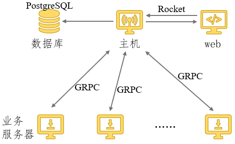

## 框架设计

本项目的整体框架设计旨在构建一个基于**Rust** 语言的自动化应用软件部署与管理工具，专为 Linux 服务器集群的运维自动化而设计，涵盖从服务器管理、软件仓库管理、任务定义到自动化部署执行的全流程。以下是项目的详细框架设计说明：

### 1. 架构概述

项目整体采用 **客户端-服务端** 架构，通过 gRPC 进行主机（管理中心）与各业务服务器节点的通信，实现软件部署任务的调度、分发与执行。同时提供基于 **Rocket** 的 Web 管理平台，用户可以通过浏览器直接管理部署任务。数据库部分使用 **PostgreSQL** 进行服务器、服务器组和软件包信息的持久化存储，前端使用 **Vue** 实现用户友好的操作界面，总体架构图如下：

### 2. 主要组件

项目包含以下核心组件：

#### 2.1 管理中心（主机）

- 功能：管理中心负责定义部署策略和任务，检测各业务服务器的状态，并向业务服务器发送安装、更新或卸载应用的命令。
- 技术实现：
  - **Tonic gRPC 服务端**：管理中心通过 gRPC 与业务服务器通信，接收服务器状态，并根据策略分发部署任务。
  - **Rocket Web 服务**：提供 RESTful API 接口，供 Web 界面与外部系统调用，实现管理操作。
  - **数据库（PostgreSQL）**：存储服务器、服务器组、软件包的元数据及部署任务和部署历史。

#### 2.2 业务服务器节点

- 功能：各个业务服务器节点接收管理中心下发的部署任务，执行应用软件的安装、更新或卸载，并向管理中心报告任务执行状态。
- 技术实现：
  - **Tonic gRPC 客户端**：业务服务器通过 gRPC 接收管理中心的指令，并回传任务执行结果。
  - **本地命令执行模块**：该模块负责调用脚本，执行具体的软件管理操作。

#### 2.3 Web 管理平台

- 功能：为运维人员提供一个友好的 Web 界面，用于查看服务器状态、管理部署包、定义部署任务、监控任务执行状态等。
- 技术实现：
  - **Rocket 框架**：Rust Web 框架，提供 REST API 接口，支持用户管理与操作。
  - **Vue.js 前端框架**：提供响应式用户界面，实现服务器、软件包及部署任务的管理视图。
  - **tonic-web 支持**：通过 `tonic_web::enable` 实现 gRPC-Web 支持，允许 Web 客户端调用 gRPC 服务。

### 3. 功能模块

#### 3.1 服务器管理

- 功能描述：允许用户在 Web 界面或通过 API 添加、删除或编辑服务器信息，并支持对服务器进行分组管理。
- 实现：
  - Web 页面显示服务器的当前状态、所属组及安装的软件版本信息。
  - 后端与 PostgreSQL 数据库交互，实现增删改查操作。

#### 3.2 软件仓库管理

- 功能描述：维护各个应用软件的版本及其下载地址，便于管理中心在部署任务中调用相应的版本进行安装或更新操作。
- 实现：
  - 数据库表用于存储各软件包的元数据信息。
  - Web 界面显示当前仓库中的所有软件包，支持添加、编辑、删除软件包操作。

#### 3.3 任务定义与调度

- 功能描述：允许用户通过 Web 界面或 API 定义部署任务，包括目标服务器（或服务器组）、软件包及部署类型（安装、更新或卸载）。
- 实现：
  - 任务通过管理中心分发给指定的业务服务器，任务完成后回传执行状态。
  - 支持全量部署、按类别或按特定业务服务器进行任务分发。

#### 3.4 自动部署与同步更新

- 功能描述：根据预设策略，自动检测服务器的状态并触发相应的部署操作，确保所有节点的软件版本同步。
- 实现：
  - 通过定期查询数据库中服务器状态与软件版本信息，判断是否需要执行更新操作。
  - 部署过程中，gRPC 服务负责任务的分发和状态的回传，确保部署的可靠性与一致性。

### 4. 模块通信设计

- **gRPC 通信**：管理中心与业务服务器通过 gRPC 通信，业务服务器接收任务并上报状态。gRPC 使用 **Tonic** 实现异步调用，支持高并发场景，减少网络开销。
- **HTTP/REST API**：Web 管理平台与后端通过 REST API 通信，提供对服务器状态、任务定义、部署监控的操作接口。
- **数据库交互**：管理中心与 PostgreSQL 数据库进行交互，存储和读取服务器、软件包及任务等数据。

### 5. 安全性与扩展性

- **安全设计**：采用 HTTPS 进行 Web 平台与 API 的通信加密，gRPC 通信中采用双向 TLS 认证，确保传输安全。
- **扩展性**：项目采用模块化架构设计，各功能模块（如任务管理、服务器管理、软件仓库管理）相互解耦，便于扩展功能或根据企业需求进行定制化开发。

### 6. 日志与监控

- **日志记录**：项目中集成日志系统，记录每次部署任务的执行情况、服务器状态的变更、用户操作日志等，便于运维人员进行问题排查和历史追溯。
- **监控功能**：在 Web 界面提供部署任务的实时监控视图，显示每台服务器的任务执行进度及执行结果。

### 7. 国产操作系统适配

- 项目设计考虑了对国产操作系统（如麒麟、Ubuntu、CentOS）的适配，确保在这些操作系统上能够无缝运行，满足自主可控的要求。

### 8. 开发与运行环境

- **开发语言**：Rust
- **Web 框架**：Rocket
- **前端框架**：Vue.js
- **数据库**：PostgreSQL
- **通信协议**：gRPC, HTTP/RESTful
- **运行环境**：Linux 服务器，兼容主流国产操作系统
