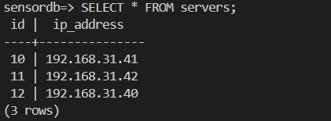

# 项目测试

目前该项目的主要功能均已实现，并搭建了前端服务，使得用户可以便捷进行部署任务的下发，现在可以直接通过前端对项目的主要功能进行测试。

**经过注册登录后，可以看到我们的服务器部署管理系统主要包含：服务器管理、服务器组管理、部署包管理、部署任务管理、服务器状态总览功能，页面简洁，且覆盖项目要求，rocket框架提供如下API给前端调用：**

## 0.测试环境

测试环境为**同一局域网下的四台Linux主机**，一台作为服务器端分发部署任务，其他三台作为客户端。

## 1.服务器管理测试

**下图为服务器管理页面，可以通过该页面对服务器进行增删查：**

**下图为添加服务器时，rocket服务器对该post行为的应答信息，如果输入的ip格式不对，则会发出错误警告：**

**下图为添加之后的数据库显示：**

**删除功能同上，此处不做过多描述，下图为rocket服务器对该delete行为的应答信息:**

**综上，该模块的前端与后端交互可以正常交互，做出预期应答，这部分测试通过。**

## 2.服务器组管理测试

**下图为服务器组管理页面，可以通过该页面对服务器组进行增删查：**

**下图为添加服务器组时，rocket服务器对该post行为的应答信息：**

**下图为添加之后的数据库显示：**

**删除功能同上，此处不做过多描述，下图为rocket服务器对该delete行为的应答信息:**

**下图为向服务器组添加指定的服务器模块：**

**可以在数据库看到该模块的成功响应：**

**综上，该模块的前端与后端交互可以正常交互，做出预期应答，这部分测试通过。**

## 3.部署包管理测试

**下图为部署包管理页面，通过这里提供的接口，可以对软件部署包进行管理，主要信息有：软件版本、软件版本号、软件描述、以及软件在主服务器上的存储路径:**

**下图为添加部署包时，rocket服务器对该post行为的应答信息：**

**下图为对部署包的修改：**

**下图为修改部署包信息时，rocket服务器对该post行为的应答信息：**

**数据库显示如下：**

**删除等功能测试在此不多赘述，综上，该模块的前端与后端交互可以正常交互，做出预期应答，这部分测试通过。**

## 4.部署任务下发测试

**这个模块为该项目的主要模块，我们可以向指定单台服务器、服务器组、所有服务器下发部署任务：**

**下图为下发部署任务时，rocket服务器对该post行为的应答信息：**

**下图为tonic服务端框架的信息，分别下发单台服务器、服务器组（包含两台服务器）、所有服务器：**

**下图为tonic客户机显示，任务为单台服务器，本地接收到部署包，部署包也未安装到本地：**

**下图为tonic客户机显示，任务为服务器组，本地接收到部署包，ip为192.168.31.41的服务器已经接收过deb包，但是还没有执行脚本安装到本地，所以在未检测到本地软件版本的时候会去检测已有的部署包版本，来判断是否需要进行更新。**

**下图为客户机脚本安装：**

**所有服务器统一部署，在ip为192.168.31.42的服务器中，已经运行了安装部署包的脚本将软件安装到了本地，所以会先检测服务器本地已安装的软件版本，会发现当前的版本号不为0，之后再进行比较看是否需要更新：**

**综上，该模块功能均能通过前端进行成功调用，测试通过。**

## 总结

- 各模块功能均已实现，前后端交互流畅，数据库记录正确，符合项目预期。

- 系统整体性能和稳定性较好，能够满足基础的服务器管理和部署需求。